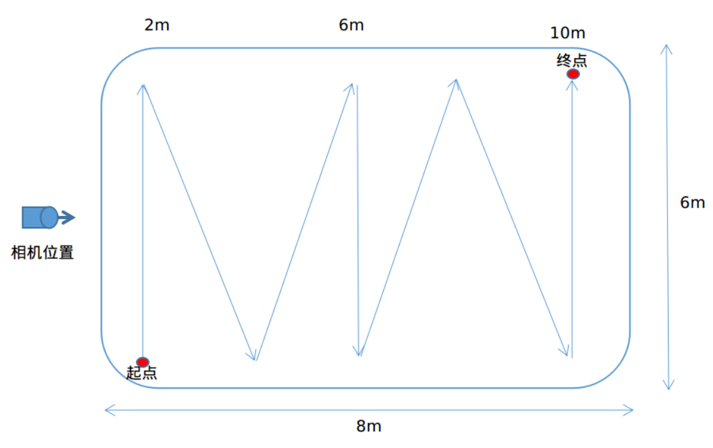
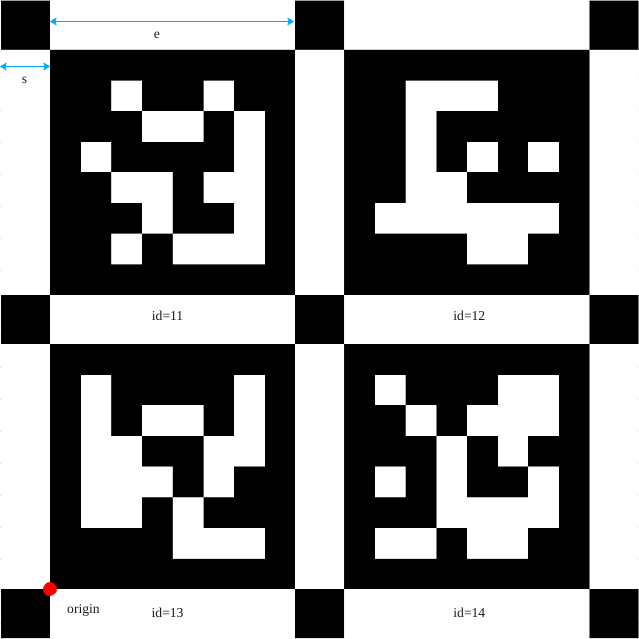
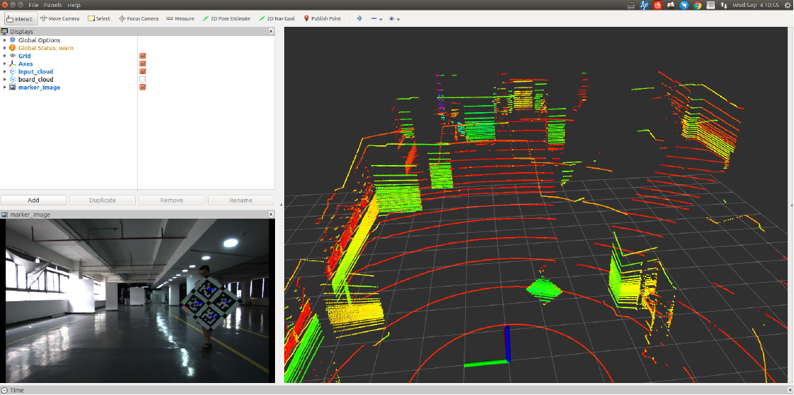

## 雷达和相机标定软件
-------------------------------------
v1.0.0

### 1 简介
lidar2cam_calib是国汽(北京)智能网联汽车研究院有限公司自主研发的激光雷达和相机的外参标定软件。该软件利用
aruco_marker制作标定板,具有操作简单、标定精度高和鲁棒性高等优点。

### 2 安装

#### 2.1 安装依赖
lidar2cam_calib软件在以下环境中测试通过:<br/>

+ 操作系统: Ubuntu 18.04
+ ROS版本: Melodic (ROS安装可参考: http://wiki.ros.org/melodic/Installation/Ubuntu)
+ PCL: 1.8.1
+ OpenCV: 3.2.0
+ Boost: 1.65
+ aruco: 3.1.4

#### 2.2 安装
```sh
mkdir -p catkin_ws/src
git clone http://192.168.10.192:8800/quchunlei/lidar_camera_calib.git
cd .. && catkin build
```

### 3 数据采集
本章节主要讲述如何采集数据,包括准备工作和数据采集两部分：
#### 3.1 准备工作
+ **标定场大小:**在相机的视场区域中应该均匀采集标定数据, 建议使用⻓10m, 宽6m的空旷场地;
+ **标定的距离:**保持标定板始终在相机视野内,同时雷达相机组件的距离范围为2~8m,保证至少有6条激
光束落在标定板上;
+ **标定板的高度:**为了保证尽可能多的点云落在标定板上, 标定板的高度应和雷达安装高度一致;

#### 3.2 采集数据
**标定数据采集的准则是:** 采集过程中, 保证图像中能够稳定的检测到marker, 同时点云中落到标定板上的雷达线数尽可能的多,至少有6条激光束落在标定板上。

数据采集人员45°手持标定板, 在标定场内M字形缓慢均匀移动, 同时在移动过程中改变标定板的姿态(左右偏转,上下偏转, 偏转⻆度不大于30°), 如下图所示（待补充）：

手持标定板示意图（待补充）：

数据采集走位示意图：
<div align="center"></img></div>
标定板偏转示意图（待补充）：

数据采集命令如下：
```sh
rosbag record -O record.bag /lidar_topic /camera_topic
```

**注：**雷达topic类型为：
sensor_msgs/PointCloud2;
相机topic类型为：
sensor_msgs/CompressedImage;

### 4 快速开始
#### 4.1 参数说明
本章节对相机内参文件camera_intrinsic_file.yaml, 配置文件rs_lidar2cam_calib.yaml中参数进行详细解释, 文件默认存放在$(find lidar2cam_calib)/config路径下。

##### 4.1.1 相机内参文件
需要在外参标定之前标定内参，相机内参文件包含了内参矩阵, 畸变系数和图像分辨率：
```yaml
CameraMat: !!opencv-matrix
   rows: 3
   cols: 3
   dt: d
   data: [ 1.9310943000000000e+03, 0., 9.4977191700000003e+02, 0.,
       1.9323061980000000e+03, 5.5201076200000000e+02, 0., 0., 1. ]
DistCoeff: !!opencv-matrix
   rows: 1
   cols: 5
   dt: d
   data: [ -5.7995600000000003e-01, 3.7999699999999997e-01,
       -1.7370000000000000e-03, 3.0929999999999998e-03,
       -1.9015499999999999e-01 ]
ImageSize: [ 1920, 1020 ]
```
其中CameraMat为相机的内参矩阵, DistCoeff为相机的畸变参数, ImageSize为图像分辨率。
注: 请将相机内参文件拷⻉到$(find lidar2cam_calib)/config路径下。

##### 4.1.2 启动参数文件
软件标定前需要修改参数配置文件, 该文件包含了传感器topic, 标定板相关参数和标定相关参数等, 存放地址为:$(find lidar2cam_calib)/config/lidar2cam_calib.yaml

例如:
```yaml
# SENSOR_TOPIC
lidar_topic: /rslidar_points
camera_topic: /usb_cam0/image_raw/compressed

# MARKER_INFO
# marker length, unit: meter
marker_length: [ 0.27328, 0.0649065 ]
# marker map layout
marker_map_file: aruco_map_90_214_7_143.yaml

# CAMERA_PARAM
# camera parameters file in $(find lidar2cam_calib)/config
cam_intrinsic_file: camera_intrinsic_file.yaml

# CALIBRATION_INFO
# [min_x, max_x, min_y, max_y, min_z, max_z], unit: meter
cloud_roi: [ -3.0, 3.0, 1.5, 8.2, -1.3, 1.2 ]
# distance between board and background, unit: meter
distance_thres: 0.15
# frames used to calibration, if set to -1, use all frames in rosbag
calib_frame_num: 100
# calibration result file will save into $(find lidar2cam_calib)/config
calib_result_file: calib_result.yaml
```

+ SENSOR_TOPIC<br/>
传感器的topic: 包括点云topic和图像topic。 根据实际rosbag数据中点云和图像的topic, 修改lidar_topic和camera_topic 的名字。

+ MARKER_INFO<br/>
标定板相关参数: 包括标定板的数量, 每块标定板上marker的数量, marker的大小, marker与边缘的距离和marker的id。
注: 目前支持标定板的数量为1, 标定板中marker的数量为4。
注: marker_length中为marker的大小$$e$$, 和marker的标定板边缘的距离$$s$$, 单位为mm, 如下图所示：
注: 标定板的marker id顺序为从上往下, 从左往右, 如下图所示:
<div align="center"></img></div>

由上图可知, 该标定板由4个markers组成,对应的id分别为11, 12, 13, 14,标定板的坐标原点位于左下⻆。

+ CALIBRATION_INFO<br/>
标定相关的参数: 点云的ROI区域, 标定板与背景的距离阈值, 用于标定的有效帧数, 标定结果文件：
其中calib_frame_num为预设的标定帧数, 如果该值为-1或者大于rosbag中的帧数, 则rosbag播放完毕后输出结果,否则到达预设帧数输出结果,退出程序。calib_result.yaml: 保存标定结果文件的名称, 存放路径为$(find rs_lidar2cam_calib)/config。

##### 4.1.3 标定板参数文件
标定板相关参数，包括marker的生成库，maker的数量，消息的类型，以及每个marker的ID和四个角点的位置；
```yaml
aruco_bc_dict: ARUCO_MIP_36h12
aruco_bc_nmarkers: 4
aruco_bc_mInfoType: 0
aruco_bc_markers:
   - { id:214, corners:[ [ 0, 8000, 0 ], [ 8000, 8000, 0 ],
       [ 8000, 0, 0 ], [ 0, 0, 0 ] ] }
   - { id:143, corners:[ [ 10000, 8000, 0 ], [ 18000, 8000, 0 ], [
       18000, 0, 0 ], [ 10000, 0, 0 ] ] }
   - { id:90, corners:[ [ 0, 18000, 0 ], [ 8000, 18000, 0 ],
       [ 8000, 10000, 0 ], [ 0, 10000, 0 ] ] }
   - { id:7, corners:[ [ 10000, 18000, 0 ], [ 18000, 18000, 0 ], [
       18000, 10000, 0 ], [ 10000, 10000, 0 ] ] }
```

#### 4.2 启动标定
+ 编译成功后,在终端中输入以下命令运行程序:<br/>
```sh
source devel/setup.bash or source devel/setup.zsh
roslaunch lidar_cam_calib_sdk lidar2cam_calib_node.launch
```

+ 播放数据包：<br/>
```sh
rosbag play xxx.bag
```

+ 在rviz中显示信息，包括点云：<br/>
<div align="center"></img></div>

+ 标定结果：

```yaml
CameraMat: !!opencv-matrix
   rows: 3
   cols: 3
   dt: d
   data: [ 1.9310943000000000e+03, 0., 9.4977191700000003e+02, 0.,
       1.9323061980000000e+03, 5.5201076200000000e+02, 0., 0., 1. ]
DistCoeff: !!opencv-matrix
   rows: 1
   cols: 5
   dt: d
   data: [ -5.7995600000000003e-01, 3.7999699999999997e-01,
       -1.7370000000000000e-03, 3.0929999999999998e-03,
       -1.9015499999999999e-01 ]
ImageSize: [ 1920, 1020 ]
CameraExtrinsicMat: !!opencv-matrix
   rows: 4
   cols: 4
   dt: d
   data: [ 9.9999348857111847e-01, 1.9654147033073849e-03,
       -3.0265426493334378e-03, 1.4949166557142852e-03,
       -3.0243398704653110e-03, -1.1227770857901252e-03,
       -9.9999479635644273e-01, -1.9449802835361807e-01,
       -1.9688026087256649e-03, 9.9999743825504839e-01,
       -1.1168256928577702e-03, -1.4881334151340356e-01, 0., 0., 0., 1. ]
Pose: [ 1.4949166557142852e-03, -1.9449802835361807e-01,
    -1.4881334151340356e-01, 1.5719131578350019e+00,
    -3.0265472698542905e-03, -1.9654249703012338e-03 ]
```
注: 相比于相机内参文件, 该文件增加了雷达到相机的外参矩阵CameraExtrinsicMat和位姿Pose；

注: 位姿Pose: [x, y, z, roll, pitch, yaw], 平移量[x, y, z]的单位: 米,旋转⻆[roll, pitch, yaw]的单位为:弧度;旋转顺序为zyx。

### 5 特殊情况处理